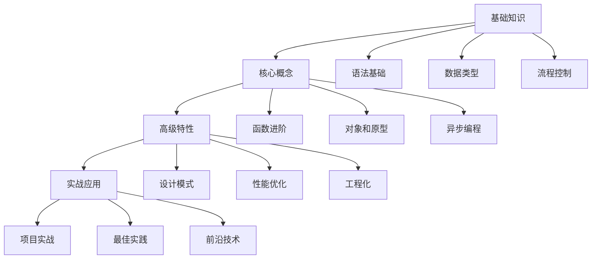

# JavaScript 修炼之路

## 为什么选择本课程？

JavaScript 作为网络时代最重要的编程语言之一，已经远远超出了最初作为网页脚本语言的定位。从前端到后端，从移动应用到桌面软件，JavaScript 的应用范围正在不断扩大。本课程将帮助你：

- 🚀 **全面掌握** JavaScript 核心概念和高级特性
- 🎯 **深入理解** 语言的设计理念和最佳实践
- 💻 **实战演练** 真实项目开发中的关键技能
- 📈 **提升能力** 解决复杂问题的编程思维

## 课程特色

### 1. 体系化的课程设计

本课程分为三大模块，帮助你循序渐进地掌握 JavaScript：

#### 基础篇
- 语言核心概念
- 变量和数据类型
- 流程控制
- 函数基础

#### 进阶篇
- 面向对象编程
- 异步编程
- 浏览器 API
- 错误处理

#### 高级篇
- 性能优化
- 设计模式
- 工程化实践
- 前沿技术

### 2. 实用的学习资源

- 📚 详细的教程文档
- 💻 在线代码编辑器
- 🎯 课后练习题
- 📝 实战项目案例

### 3. 互动式学习体验

- 🤝 在线答疑解惑
- 👥 学习社区交流
- 📢 实时更新内容
- 🎮 趣味编程练习

## 学习路线图

## 适合人群

- 🎯 零基础编程学习者
- 💼 前端开发工程师
- 🔄 全栈开发工程师
- 📚 在校计算机相关专业学生
- 🚀 希望提升技术能力的开发者

## 学习建议

1. **打好基础**
   - 认真学习每个概念
   - 动手实践每个示例
   - 理解而不是记忆

2. **勤于练习**
   - 完成课后练习题
   - 参与实战项目
   - 创建个人项目

3. **善于思考**
   - 理解原理机制
   - 总结知识要点
   - 举一反三

4. **及时反馈**
   - 记录学习疑问
   - 积极提问交流
   - 分享学习心得

## 开始学习

准备好开始你的 JavaScript 学习之旅了吗？

  <a href="/class/js/1.html" class="primary-button">开始学习</a>
  <a href="/playground/index.md" class="secondary-button">在线练习</a>

::: tip 温馨提示
学习编程是一个循序渐进的过程，保持耐心和持续学习的热情是成功的关键。
:::

## 加入我们

如果你在学习过程中有任何问题或建议，欢迎：

- 📧 发送邮件到：contact@funfe.cn
- 💬 加入学习社群
- ⭐ 关注我们的 GitHub
- 📢 订阅更新通知

让我们一起在 JavaScript 的世界中探索和成长！

